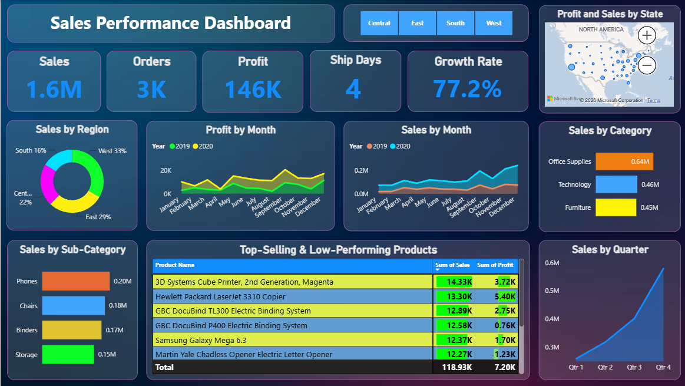
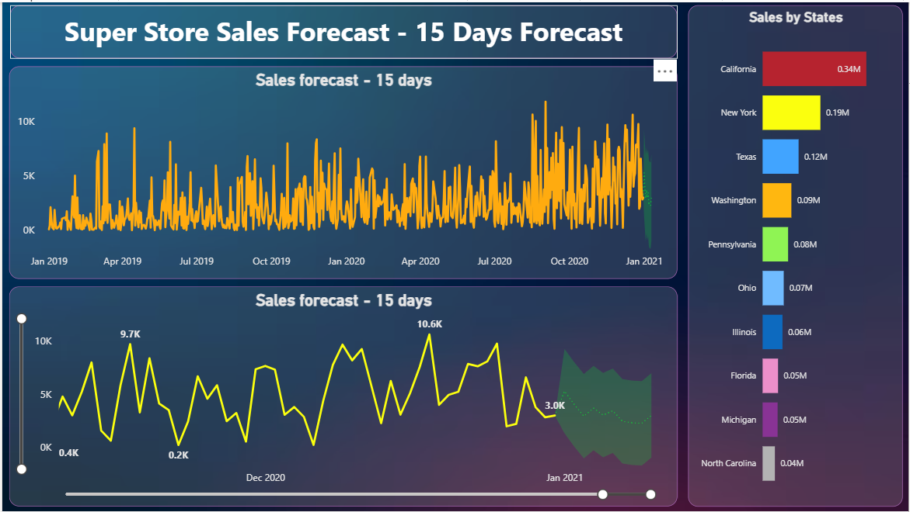

# 📊 Sales Performance Dashboard

An interactive **Power BI dashboard** built as part of the **SyntecxHub Data Analysis Internship Program**.

---

## 📌 Project Overview

This project analyzes a Superstore sales dataset to uncover business insights around revenue, profit, regional performance, and product trends. The dashboard helps stakeholders quickly identify top-performing and under-performing products, track growth over time, and compare performance across regions and categories.

---

## 🎯 Objectives (as per project brief)

- Import and clean the raw sales dataset
- Analyze monthly, quarterly, and yearly sales trends
- Identify top-selling products and low-performing items
- Perform region-wise and category-wise sales comparison
- Build KPIs for total revenue, profit, and growth rate
- Build an interactive dashboard using Power BI

---

## 🛠️ Tools Used

- **Power BI Desktop** — data modeling, DAX measures, visualization
- **Power Query (M)** — data cleaning and transformation
- **DAX** — custom measures (e.g., Growth Rate)

---

## 🧹 Data Cleaning (Power Query)

The following cleaning steps were applied to the raw dataset before analysis:

| Step | Description |
|---|---|
| **Replaced Value** | Filled blank/`#N/A` values in the `Returns` column with `0` |
| **Removed Columns** | Dropped unused helper columns |
| **RemovedDuplicates** | Applied `Table.Distinct()` to remove any duplicate transaction rows |
| **RemovedInvalidProfitRows** | Removed transactions where `Profit > Sales` (a logical impossibility caused by data entry errors in the source file — 14 such rows were identified and excluded) |
| **AvgDelivery (calculated column)** | Added `DATEDIFF(Order Date, Ship Date)` to measure delivery performance per order |

---

## 📈 Dashboard Features

### Page 1: Sales Performance Dashboard
- **KPI Cards:** Total Sales, Orders (distinct count), Profit, Avg. Ship Days, Growth Rate (YoY %)
- **Sales by Region** — donut chart
- **Profit and Sales by State** — interactive map
- **Sales by Month & Profit by Month** — trend comparison across 2019 vs 2020
- **Sales by Quarter** — quarterly trend analysis
- **Sales by Category / Sub-Category** — bar charts
- **Top-Selling & Low-Performing Products** — sortable table (click "Sum of Sales" column header to switch between top-selling and low-performing view)
- **Region slicer** — filters the entire dashboard interactively

### Page 2: Sales Forecast
- 15-day sales forecast using Power BI's built-in forecasting
- Sales by State breakdown

---

## 📐 Key DAX Measure

```dax
Growth Rate = 
VAR CurrentYear = YEAR(MAX('SuperStore_Sales_Dataset'[Order Date]))
VAR CurrentSales = CALCULATE(
    SUM('SuperStore_Sales_Dataset'[Sales]), 
    YEAR('SuperStore_Sales_Dataset'[Order Date]) = CurrentYear
)
VAR PreviousSales = CALCULATE(
    SUM('SuperStore_Sales_Dataset'[Sales]), 
    YEAR('SuperStore_Sales_Dataset'[Order Date]) = CurrentYear - 1
)
RETURN 
DIVIDE(CurrentSales - PreviousSales, PreviousSales, 0)
```

This measure calculates year-over-year sales growth, fully responsive to slicer filters (e.g., Region).

---

## 🖼️ Dashboard Preview




---

## 📂 Files in this Repository

| File | Description |
|---|---|
| `Sales_Performance_Dashboard.pbix` | Power BI dashboard file |
| `screenshots/` | Dashboard preview images |
| `README.md` | Project documentation |

---

## 🔍 Key Insights

- Sales showed a strong upward trend in Q4, particularly in 2020
- Office Supplies is the top-performing category by sales
- A small number of products account for a disproportionate share of profit, while some high-sales products show low or negative margins — highlighting pricing/cost issues worth investigating
- During data cleaning, 14 transactions were found with Profit greater than Sales — a data quality issue in the source file, which was excluded from the final analysis
- Regional delivery performance is consistent (~3.9 days average) with only minor variance across regions

---

## 🙋 About

Built by **[Satyam Kumar Singh]** as part of the **SyntecxHub Internship Program** (Data Analysis Track).

🔗 Connect with me on [LinkedIn](#)  
🌐 [SyntecxHub](https://www.syntecxhub.com)
